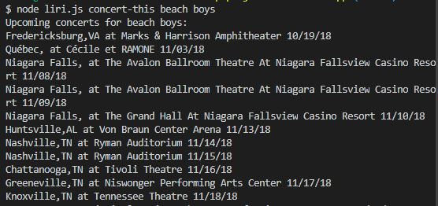
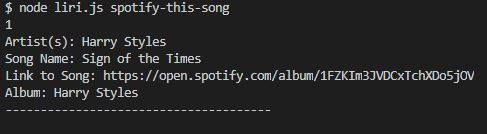
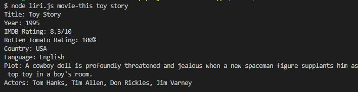
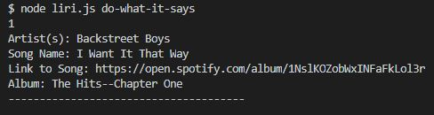

# Liri Node App

Liri is an application designed to for the UNCC fall 2018 fullstack bootcamp

## Brief Overview 

Liri is a command line Node.js application that looks at some of the very basics of Node.js. It takes a command and a search term and returns the result from an API. This video provides a walkthrough of the application. [Video Walkthrough](https://youtu.be/ytNsEVeKz74)

### concert-this
Concert-this uses Bandsintown API to search for a band provided by the user.  The results from this search are the city, the state, the venue, and the date of when the concert takes place.  

### spotify-this-song
spotify-this-song uses the spotify API to search for a song. The results are the top 20 songs with user provided title. The result will include the artist name, song title, a link to the song on spotify, and the album the song is on.

### movie-this
movie-this uses the OMDB API to search for a movie. This will return the top result for the user provided movie title. The result will include the title, the year produced, the IMDB rating, Rotten Tomato rating, the country the movie was produced in, the language the movie is in, the plot, and the top actors/actress in the movie.

### do-what-it-says
do-what-it-says reads from the random.txt file and uses spotify-this-song to search for the provided song "I Want it That Way".

### log.txt
Liri also keeps a log of all of the user inputs and the results.

